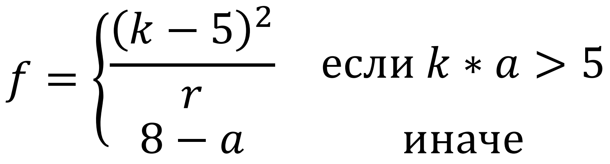

Гурьянов Евгений
Вариант 7 (2.07)


# МЗЯиОК 2021 (вариант 2.7)

## Лабораторная работа №2. Программирование целочисленных вычислений.
Вычислить целочисленное выражение:


## Лабораторная работа №3. Программирование ветвлений и циклов.
Вычислить целочисленное выражение:



## Лабораторная работа №4. Программирование обработки массивов и матриц.
Дана матрица 4х6. Определить сумму элементов каждого столбца. Организовать ввод матрицы и вывод результатов.

## Лабораторная работа №5. Программирование с использованием разноязыковых модулей.
Дан текст не более 255 символов. Слова отделяются друг от друга пробелами. Удалить из текста слова с указанными номерами.
Второй модуль должен использовать ковенцию: pascal.
Третий модуль должен использовать ковенцию: stdcall.

## Домашнее задание №1. Обработка символьной информации.
Дана последовательность 37 символов. Определить частоту повторения каждого символа.

## Домашнее задание №2. Лексические и синтаксические анализаторы.
Разработать грамматику и распознаватель описания языка программирования C++, включающего оператор цикла-пока и оператор присваивания. Считать, что условие – значение переменной логического типа, тело цикла содержит не более одного оператора, а оператор присваивания в правой части содержит только идентификаторы или целые константы. Например:

```c++
while (d) while (ii) gyu=5;
```
