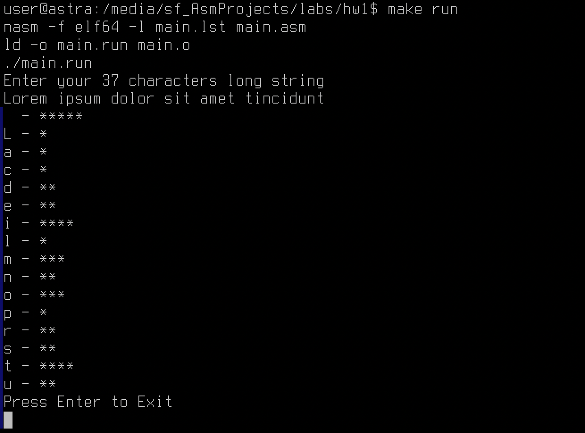

# Домашняя работа №1

## Выполнил Гурьянов Евгений

---

$$\text{Вариант 2.7}$$

# Задача

**Цель работы:**  
изучение команд обработки цепочек и приемов обработки символьной информации

**Задача:**  
Дана последовательность 37 символов. Определить частоту повторения каждого символа.

# Основная часть

## Исходный код программы:

```asm
	%include "../lib64.asm"
	
	%macro write_string 2
	; вывод
	mov rax, 1                   ; системная функция 1 (write)
	mov rdi, 1                   ; дескриптор файла stdout=1
	mov rsi, %1                  ; адрес выводимой строки
	mov rdx, %2                  ; длина строки
	syscall                      ; вызов системной функции
	%endmacro
	
	%macro read_string 2
	; ввод
	mov rax, 0                   ; системная функция 0 (read)
	mov rdi, 0                   ; дескриптор файла stdin=0
	mov rsi, %1                  ; адрес вводимой строки
	mov rdx, %2                  ; длина строки
	syscall                      ; вызов системной функции
	%endmacro
	
	%macro str_to_int 1
	; перевод string в integer
	call    StrToInt64          ; вызов процедуры
    cmp     rbx, 0              ; сравнение кода возврата
    jne     StrToInt64.Error    ; обработка ошибки
    mov     %1, eax            
%endmacro
	
	%macro int_to_str 2
	; перевод integer в string
	mov rsi, %2
	mov ax, %1                   ; получение числа из памяти
	cwde
	call IntToStr64              ; вызов процедуры
	cmp rbx, 0                   ; сравнение кода возврата
	jne StrToInt64.Error         ; обработка ошибки
	%endmacro
	
	section .data                ; сегмент инициализированных переменных
	
	InputPrompt db "Enter your 37 characters long string", 10
	lenInputPrompt equ $ - InputPrompt
	
InputPromptRow db " row: "
	lenInputPromptRow equ $ - InputPromptRow
	
ResultMsg db "Result:"
	lenResult equ $ - ResultMsg
	
	ExitMsg db "Press Enter to Exit", 10 ; выводимое сообщение
	lenExit equ $ - ExitMsg

	mark db " - "
	ast db "*"
	newline db 10
	
	section .bss                 ;сегмент неинициализированных переменных
	
	InBuf resb 38                ; буфер для вводимой строки
	lenIn equ $ - InBuf
	
	OutBuf resb 10               ; буфер для вводимой строки
	
	freqs resb 256

	i resq 1
	j resb 1
	
	section .text                ; сегмент кода
	
	global _start
_start:
	
	; =Вводим данные=
	write_string InputPrompt, lenInputPrompt ; выводит приглашение
	
	read_string InBuf, lenIn
	
	; =Считаем частоты=
	mov rcx, 0
	lp:
	mov rdx, [InBuf + rcx]
	and rdx, 255
	inc byte [freqs + rdx]
	inc rcx
	cmp rcx, 37
	jl lp

	; =Выводим частоты=
	mov qword [i], 32
	lp2:
	mov rdx, qword [i]
	mov cx, [freqs + rdx]
	mov [j], cx
	cmp byte [j], 0
	je skip

	write_string i, 1
	write_string mark, 3

	lp3:
	cmp byte [j], 0
	jle end
	dec byte [j]
	write_string ast, 1
	jmp lp3

	end:
	write_string newline, 1
	skip:
	inc qword [i]
	cmp qword [i], 127
	jl lp2
	
	; write
	mov rax, 1                   ; системная функция 1 (write)
	mov rdi, 1                   ; дескриптор файла stdout=1
	mov rsi, ExitMsg             ; адрес выводимой строки
	mov rdx, lenExit             ; длина строки
	syscall                      ; вызов системной функции
	; read
	mov rax, 0                   ; системная функция 0 (read)
	mov rdi, 0                   ; дескриптор файла stdin=0
	mov rsi, InBuf               ; адрес вводимой строки
	mov rdx, lenIn               ; длина строки
	syscall                      ; вызов системной функции
	; exit
	mov rax, 60                  ; системная функция 60 (exit)
	xor rdi, rdi                 ; return code 0
	syscall                      ; вызов системной функции

```

## Пример работы программы



**Вывод:**  

В результате выполнения лабораторной работы была разработана программа, работающая со строковой информацией
