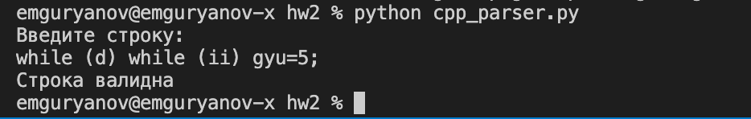

#  работа №2

## Выполнил Гурьянов Евгений

---

$$\text{Вариант 2.7}$$

# Задача

**Цель работы:**  
закрепление знаний теоретических основ и основных методов приемов разработки лексических и синтаксических анализаторов регулярных и контекстно- свободных формальных языков.

**Задача:**  
Разработать грамматику и распознаватель описания языка программирования C++, включающего оператор цикла-пока и оператор присваивания. Считать, что условие – значение переменной логического типа, тело цикла содержит не более одного оператора, а оператор присваивания в правой части содержит только идентификаторы или целые константы. Например:

```c++
while (d) while (ii) gyu=5;
```

# Основная часть

## БНФ

```bnf
<statement> ::= <assignment> ";" | <while> ";"

<assignment> ::= <var> "=" <expression> // присваивание

<expression> ::= <var> | <integer> // выражение

<integer> ::= <natural> | "-" <natural> // целое число

<natural> ::= <digit> | <digit> <natural> // натуральное число

<while> ::= "while(" <var> ")" <assignment> | "while(" <var> ")" <while> // цикл while

<var> ::= <letter> <var_tail> // имя переменной (должно начинаться с буквы)

<var_tail> ::= "" | <alphanumeric> <var_tail> // конец имени переменной (может содержать буквы и цифры)

<alphanumeric> ::= <digit> | <letter> // буква или цифра

<digit> ::= "0" | "1" | "2" | "3" | "4" | "5" | "6" | "7" | "8" | "9" | "0" // цифра

<letter> ::= "a" | "A" | "b" | "B" | "c" | "C" | "d" | "D" | "e" | "E" | "f" | "F" | "g" | "G" | "h" | "H" | "i" | "I" | "j" | "J" | "k" | "K" | "l" | "L" | "m" | "M" | "n" | "N" | "o" | "O" | "p" | "P" | "q" | "Q" | "r" | "R" | "s" | "S" | "t" | "T" | "u" | "U" | "v" | "V" | "w" | "W" | "x" | "X" | "y" | "Y" | "z" | "Z" // буква
```

## Исходный код программы:

```py
import re
from typing import Callable, List, Pattern, Tuple

Parsed = Tuple[str, bool]
Parser = Callable[[str], Parsed]


def from_pattern(pattern: str) -> Parser:
    pattern: Pattern[str] = re.compile(pattern)

    def parser(s: str) -> Parsed:
        match = pattern.match(s)
        if match is not None:
            return s[match.end():], True
        return s, False

    return parser


def from_options(options: List[Parser]) -> Parser:
    def parser(s: str) -> Parsed:
        for option in options:
            leftover, ok = option(s)
            if ok:
                return leftover, True
        return s, False

    return parser


def from_sequence(parts: List[Parser]) -> Parser:
    def parser(s: str) -> Parsed:
        for option in parts:
            leftover, ok = option(s)
            if not ok:
                return s, False
            s = leftover
        return s, True

    return parser


def from_recursion(breaking: Parser, recursive: Parser) -> Parser:
    def parser(s: str) -> Parsed:
        leftover, ok = recursive(s)
        if ok:
            leftover, ok = parser(leftover)
            if ok:
                return leftover, True
        leftover, ok = breaking(s)
        if ok:
            return leftover, True
        return s, False

    return parser


is_letter = from_pattern(r'[a-zA-Z]')

is_digit = from_pattern(r'[0-9]')

is_alphanumeric = from_options([is_letter, is_digit])

is_var_tail = from_recursion(from_pattern(r''), is_alphanumeric)

is_var = from_sequence([is_letter, is_var_tail])

is_natural = from_recursion(is_digit, is_digit)

is_integer = from_options([
    is_natural,
    from_sequence([from_pattern(r'-'), is_natural])]
)

is_expression = from_options([is_var, is_integer])

is_assignment = from_sequence([
    is_var,
    from_pattern(r'='),
    is_expression
])

while_breaking = from_sequence([
    from_pattern(r'while\('),
    is_var,
    from_pattern(r'\)'),
    is_assignment,
])

while_recursive = from_sequence([
    from_pattern(r'while\('),
    is_var,
    from_pattern(r'\)'),
])

is_while = from_recursion(while_breaking, while_recursive)

is_statement = from_sequence([
    from_options([is_assignment, is_while]),
    from_pattern(r';')
])


def parse_string(s: str):
    s = s.replace(' ', '')
    leftover, ok = is_statement(s)
    return ok and leftover == ''


if __name__ == "__main__":
    print('Введите строку:')
    s = input()
    if parse_string(s):
        print('Строка валидна')
    else:
        print('Строка не валидна')

```

## Пример работы программы



## Проверка результатов работы программы

| Входная строка                | Ожидание | Реальность |
|-------------------------------|----------|------------|
| "while (d) while (ii) gyu=5;" | Ok       | Ok         |
| "while (d) gyu=5;"            | Ok       | Ok         |
| "gyu=5;"                      | Ok       | Ok         |
| "while (d) while (ii) gyu=5"  | Err      | Err        |
| "while (d) gyu=2 + 2;"        | Err      | Err        |


**Вывод:**  

В результате выполнения лабораторной работы была разработана программа, закрепляющая знания теоретических основ и основных методов приемов разработки лексических и синтаксических анализаторов регулярных и контекстно-свободных формальных языков.
